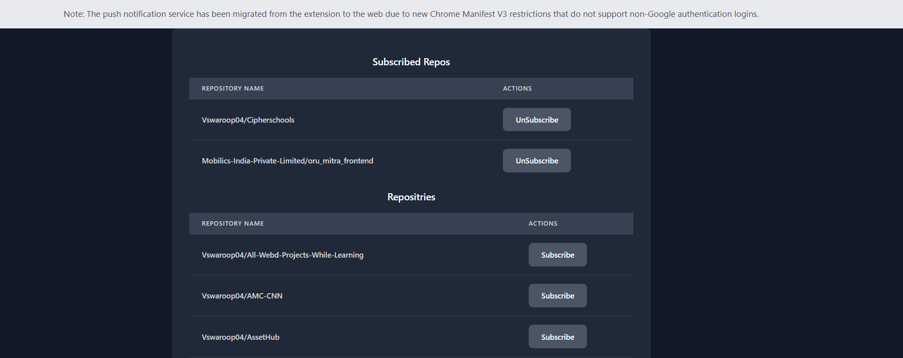
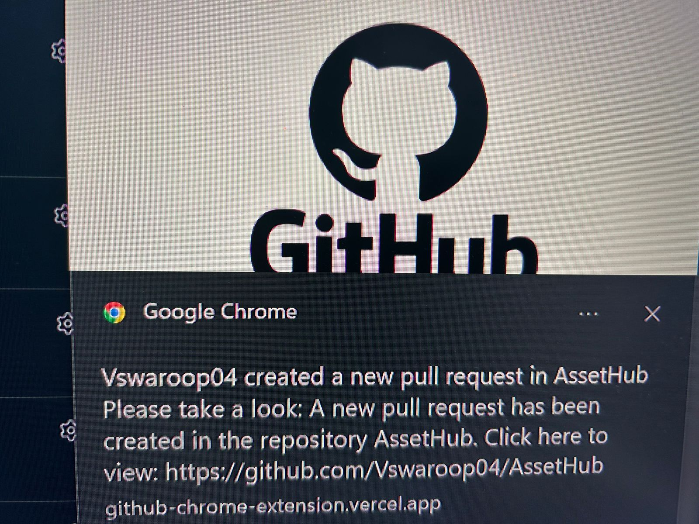

# GitHub Chrome Extension

This Chrome extension allows users to subscribe to repositories for push and pull request notifications.
Note: Intially this was a complete extension but later on this push notification service has been migrated from the extension to the web due to new Chrome Manifest V3 restrictions that do not support non-Google authentication logins.

## Features

- Subscribe to repositories to receive notifications for push and pull requests.
- Integrated with GitHub API for real-time updates.
- Built with Vite React, Node.js with Express, and TypeScript.
- 


## Installation

1. Clone the repository:

   ```bash
   git clone https://github.com/your-username/github-chrome-extension.git
   cd github-chrome-extension
   ```

2. Install dependencies using npm in both client/ and server/:

   ```bash
   npm install
   ```

3. Create a .env file based on .env.example and configure your environment variables.

4. Install dependencies using npm in both client/ and server/:

   ```bash
   npm run dev
   ```

## Screenshots






## Contributing

Contributions are welcome! Please fork this repository and submit a pull request.

## License

This project is licensed under the MIT License - see the LICENSE file for details.

<p align="center">
  Made with ❤ by Vishnu
</p>
